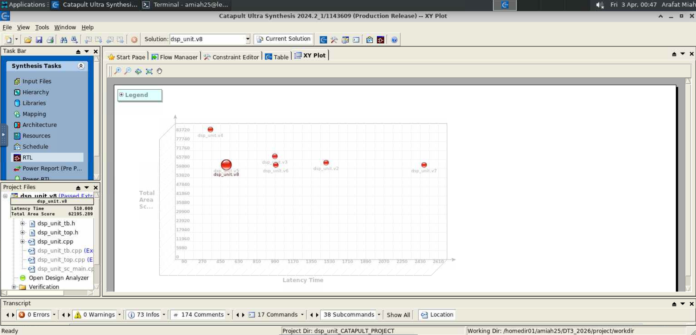

# High-Level Synthesis (HLS) of an Audio DSP Filter

## Overview
This repository contains the implementation, optimization, and verification of a Digital Signal Processing (DSP) unit using High-Level Synthesis (HLS). The primary objective of this project was to synthesize a C++/SystemC behavioral model into an optimized Register-Transfer Level (RTL) Verilog design, balancing aggressive area and latency constraints for real-time audio processing.

## Tools Used
* **Siemens EDA Catapult:** High-Level Synthesis (HLS) and Architecture Exploration
* **Synopsys Design Compiler:** Logic Synthesis (using the Nangate 45nm Open Cell Library)
* **QuestaSim:** SystemC and RTL Verification/Simulation

## Architecture Exploration & Optimization
The core challenge of this project was finding the optimal hardware architecture by applying synthesis constraints (Directives) rather than manually rewriting Verilog logic. The baseline, unconstrained design required 150 clock cycles to process a single audio sample, which offered no safety margin against the real-time system deadline.

Through an iterative optimization loop, I explored different microarchitectures by unrolling shift loops and pipelining math loops to find the perfect balance of speed and physical size.

*Figure 1: Architecture exploration showing the Pareto front trade-off between Total Area Score and Latency Time.*

As shown in the X/Y plot above, multiple solutions were generated to analyze the hardware trade-offs. The winning design (**`dsp_unit.v8`**, highlighted in red) represents the ultimate "sweet spot":
* **Constraints Applied:** Shift loop fully unrolled; Math loop pipelined with an Initiation Interval (II) of 1.
* **Result:** Latency dropped massively from 150 cycles to just **51 cycles** (510.00 ns), while maintaining a highly optimized estimated area score of **62,195**.

## Verification
To prove the generated hardware was mathematically flawless, an automated verification testbench was utilized. The physical RTL hardware output was compared line-by-line against the golden SystemC reference output using the Linux `diff` command. The outputs were 100% identical, confirming that the aggressive timing optimizations did not introduce any mathematical errors or dropped audio frames.

## Logic Synthesis (Gate-Level Reality)
After finalizing the RTL in Catapult, the design was pushed through Synopsys Design Compiler. This phase highlighted the difference between HLS estimation and physical reality:
* **HLS Estimated Area:** 62,195
* **Actual Gate-Level Area:** 54,968
Design Compiler was able to share and optimize physical gates further, resulting in a smaller physical footprint with a passing timing slack of 0.88 ns on a 10.0 ns clock.

## Key Learnings
Transitioning to HLS requires a massive paradigm shift from traditional RTL coding. Grasping how high-level C++ algorithms translate into scheduled, physical hardware is conceptually complex and requires a deep understanding of timing deadlines versus hardware promises. 

## Disclaimer
This repository contains **only a portion of the full laboratory project** and is shared **solely for demonstration and portfolio purposes**.

It is **not intended to be used as a solution reference** for academic coursework or assessments.  
Any reuse should be for learning or professional evaluation only.

---

## Author
**Arafat Miah**  
RTL / Digital Design

The main takeaway from this project is the sheer power of tool-driven architecture exploration. By modifying a few GUI constraints and TCL directives, I was able to completely redesign the physical silicon—from a slow, shared-resource architecture to a blazing-fast pipelined DSP—without rewriting a single line of functional C++ code.
